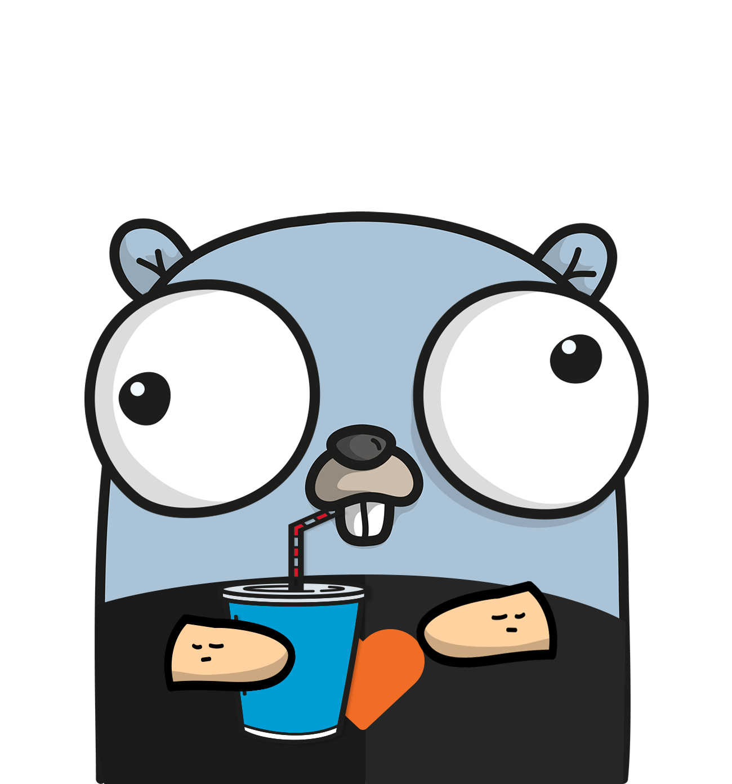

    <a href="https://dev.azure.com/ljvmiranda/ljvmiranda/_build/latest?definitionId=6&branchName=master"></img></a>
    <a href="https://goreportcard.com/report/github.com/ljvmiranda921/burnout-barometer"></img></a>
    <a href="https://godoc.org/github.com/ljvmiranda921/burnout-barometer"></img></a>
    <a href="https://golangci.com"></img></a>

**Burnout Barometer** is a Slack tool to log, track, and assess you or your
team's stress and work-life.

**Want to get started?** [**Download the burnout barometer**](https://ljvmiranda921.github.io/burnout-barometer/download/) or just:

## Highlights

* Track your emotional state straight from Slack
* Log events are stored and tracked in Postgres or BigQuery
* Easy to set-up and deployable in a severless fashion (Cloud Run, FaaS, etc.)

Learn more about this project in the
[documentation](https://ljvmiranda921.github.io/burnout-barometer/)!

## Contributing 

This project is open for contributors! Contibutions can come in the form of
feature requests, bug fixes, documentation, tutorials and the like! We highly
recommend to file an Issue first before submitting a Pull Request.

Simply fork this repository and make a Pull Request! We'd definitely appreciate:

- Implementation of new features
- Bug Reports
- Documentation
- Testing

Be sure to check our [Contribution
Guidelines](https://ljvmiranda921.github.io/burnout-barometer/contributing.html)
before starting.

## License

MIT License, Copyright (c) 2020 Lj Miranda

